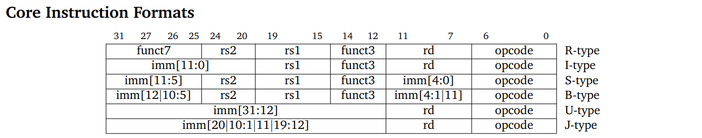
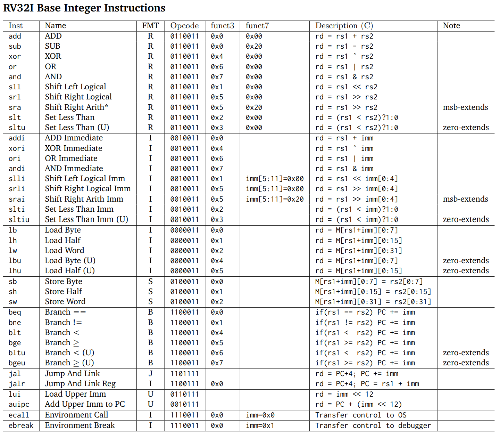

一些基础内容：

1. 下面设计的内容源于`RISC-V`的`RV32I`指令集
2. 内存的基础单位为`byte`，即 8bit
3. 1 word = 4 byte

# 一些基础知识：

## 大端与小端

比如将`0x11223344`存入内存

|         顺序          | 0x0  | 0x4  | 0x8  | 0xC  |
| :-------------------: | :--: | :--: | :--: | :--: |
|  大端（big-endian）   | 0x11 | 0x22 | 0x33 | 0x44 |
| 小端（little-endian） | 0x44 | 0x33 | 0x22 | 0x11 |

RISC-V 采⽤⼩端规则

## 寄存器

在本书中，每个寄存器都是 64 位的

| Register name | Symbolic name | Description                          | Saved by |
| ------------- | ------------- | ------------------------------------ | -------- |
| x0            | zero          | 硬连接线为 0 always zero             |          |
| x1            | ra            | 返回地址，函数中一般需要保存在栈中   | Caller   |
| x2            | sp            | 栈指针                               | Callee   |
| x3            | gp            | Global pointer                       |          |
| x4            | tp            | Thread pointer                       |          |
| x5            | t0            | Temporary / alternate return address | Caller   |
| x6–7          | t1–2          | Temporaries                          | Caller   |
| x8            | s0/fp         | Saved register / frame pointer       | Callee   |
| x9            | s1            | Saved register                       | Callee   |
| x10–11        | a0–1          | Function arguments / return values   | Caller   |
| x12–17        | a2–7          | Function arguments                   | Caller   |
| x18–27        | s2–11         | Saved registers                      | Callee   |
| x28–31        | t3–6          | Temporaries                          | Caller   |

别名为 t 开头的寄存器（x5-x7，x28-x31），t 是指 temporary，意为使用时无需保护的临时寄存器

别名为 a 开头的寄存器（x10-x17），a 是指 argument，意为函数调用时传递的参数

别名为 s 开头的寄存器（x8-x9，x18-x27），s 是指 saved，意为使用这些寄存器前需要保存原先的值

### Caller-saved / Callee-saved

简单而言，`Caller-saved`要求在调用前保存；而`Callee-saved`要求在调用后的环境内保存。

比如以函数环境为例，`Caller-saved`的寄存器如果在函数中要用到，则必须在进入函数前就保存好，而`Callee-saved`需要在进函数后保存。

这样做最主要的好处是规范化，从而减少重复保存的工作。

### x0 寄存器

x0 寄存器是一个特殊的寄存器，它被硬编码为 0，也就是说，任何时候读取 x0 寄存器的值都会得到 0，同时，任何写入 x0 寄存器的操作都会被丢弃，不会影响其值。这个特性使得 x0 寄存器在编程和指令集设计中非常有用，因为它提供了一个常量 0 的来源，并且可以作为一个“丢弃”操作的结果的目标寄存器。

由于 x0 寄存器的这一特性，它经常被用于简化指令集和编译器优化。例如，RISC-V 没有单独的`nop`（无操作）指令，而是可以通过写入 x0 寄存器来实现，如`addi x0, x0, 0`，这条指令实际上不会对程序状态产生任何影响，因为它写入了一个会被丢弃的寄存器。

此外，x0 寄存器也用于实现其他一些操作，比如取负数指令可以通过`sub rd, x0, rs`来实现，这里`x0 - rs`等价于`0 - rs`，也就是`-rs`。同样，跳转指令也可以通过写入 x0 寄存器来实现，因为写入 x0 的任何值都会被丢弃，所以不会影响程序的状态。

总的来说，x0 寄存器的设计是为了提高指令集的效率和简化编译器的工作，它不能被改变值，总是恒定为 0，写入操作会被忽略。

## 指令集

> 参考[rv32i reference card](https://www.cs.sfu.ca/~ashriram/Courses/CS295/assets/notebooks/RISCV/RISCV_CARD.pdf)

### 参数解释

- `opcode`: 操作码
- `func3/func7`: 操作码的拓展位
- `rd`: register destination，即目标寄存器
- `rs1/rs2`: register source, 即源寄存器
- `imm`: 立即数，也就是一般的常数

### 类型解释

| 目的                         | 类型       |
| ---------------------------- | ---------- |
| 用于寄存器-寄存器操作        | R 类型指令 |
| 用于短立即数和访存 load 操作 | I 型指令   |
| 用于访存 store 操作          | S 型指令   |
| 用于条件跳转操作             | B 类型指令 |
| 用于长立即数                 | U 型指令   |
| 用于无条件跳转               | J 型指令   |

### 一些缩略指令

1. `not rd rs1` = `xor rd rs1 -1`

   注意：`1 xor x = ~x`

2. `mv rd rs` = `addi rd rs 0`
3. `j imm` = `jal x0 imm`
4. `beqz rs imm` = `beq x0 rs imm`
5. `neg rd rs` = `sub rd x0 rs`
6. `nop`(空指令) = `addi x0 x0 0`

### 一些小知识点

1. ` slli``srli``srai `: 最后有一个`func6`，因为位移最多位移 64 位，只需要占 6 个 bit 就行
2. ` srli``srai `:`func6`有区别，因为他们`opcode`与`func3`完全相同
3. `j-type`和`b-type`的指令的立即数都没有最低位，因为指令长 32 位，占 4 个 byte，从而 PC 最后两位保持不变，这样做可以尽可能增加跳转的范围。（但考虑有半指令以及压缩指令，所以只舍去了最低位）。

### 一些常用指令

## 并行：

- `lr.d`:lr.d（Load Reserved）：这条指令用于从指定的内存地址加载一个 64 位的数据到寄存器中。在加载数据的同时，它会在该内存地址上设置一个保留标记（reservation set）。这个保留标记的目的是告诉其他处理器或硬件，这个地址已经被当前处理器“保留”，以实现对该地址的独占访问。lr.d 指令通常用于开始一个原子操作序列，确保在随后的指令执行期间，其他处理器不会干扰这个内存地址。需要注意的是，使用 lr.d 指令时，内存地址需要按照 64 位宽度对齐，否则会触发非对齐异常
- `sc.d`:这条指令用于将一个 64 位的数据从寄存器写回到之前通过 lr.d 指令设置保留标记的内存地址。在写入数据之前，sc.d 指令会检查该内存地址上的保留标记是否仍然有效。如果保留标记有效，那么数据会被写入内存，并且寄存器 rd 会被设置为 0，表示写入成功。如果保留标记无效（可能是因为其他处理器已经访问了这个地址），那么数据不会被写入，寄存器 rd 会被设置为 1，表示写入失败。无论成功与否，sc.d 指令都会清除之前设置的保留标记

这一对指令通常用于实现原子的比较并交换（CAS）操作，这是一种在多处理器系统中同步访问共享数据的机制。通过使用 lr.d 和 sc.d 指令，可以确保在多个处理器或线程尝试修改同一数据时，只有一个能够成功，从而避免了数据竞争和不一致的问题。此外，lr.d 和 sc.d 指令还支持通过可选的后缀.aqrl 来添加额外的内存顺序限制，以满足不同的同步需求。
