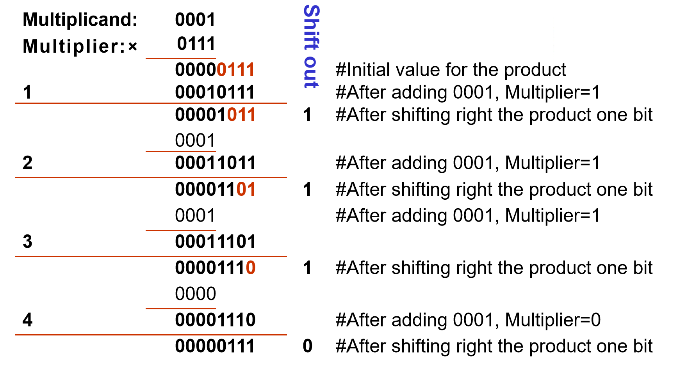
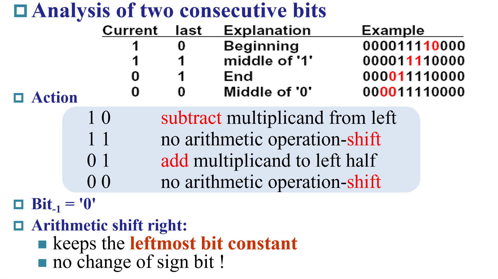
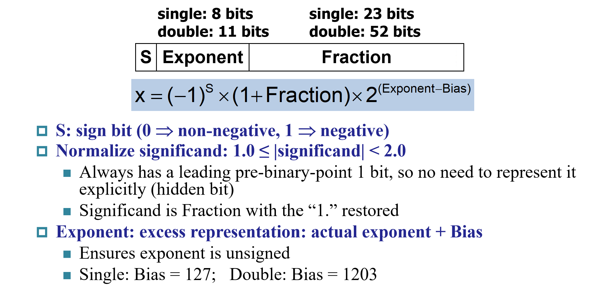
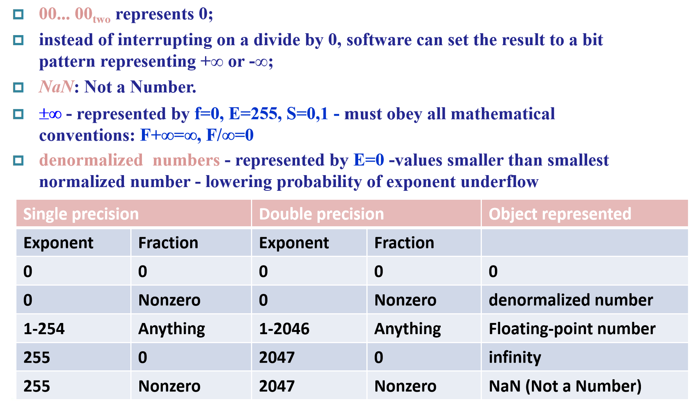

### 更快的加法器

#### CLA（Carry-Lookahead Adder）

在 RCA 中，进位位与和位一起计算，并且每个级必须等到前一个进位位计算完毕后才能开始计算自己的进位位，导致速度较慢。

而在 CLA 中，提前计算出了前几位的进位，使得后续全加器不必前一位等待门延迟较高的和位计算，从而大大提高了速度。

一般要保持扇入扇出与提前进位的平衡，若扇入扇出很大，也会造成时间的延长。

它的另一个优点是速度稳定，有利于流水线运行。

#### Carry-Skip Adder

Carry-Skip Adder 是一种并行加法器，它通过跳过一些不需要进位的位来减少进位传递的时间。

具体来，对于某一位，若进位传递函数（Pi）的所有输入都为 1 或都为 0，则该位的进位可以直接跳过中间位，直接传递到后续的某一位。这样可以减少进位传递的延迟，从而加快加法运算的速度。比如：1 与 1，可以直接进位 1；0 与 0 就直接进位 0。

平均来说，可以加快一半的进位速度，但不稳定，不适用于流水线运行。

#### CSA（Carry-select Adder）

进位选择加法器一般由纹波进位加法器和多路复用器组成。使用进位选择加法器将两个 n 位数字相加是通过两个加法器（因此是两个纹波进位加法器）完成的，以便执行两次计算，一次假设进位为零，另一次假设进位为零这将是一个。计算出两个结果后，一旦知道正确的进位输入，就可以使用多路复用器选择正确的总和以及正确的进位输出。

这种设计可以显著提高加法器的运算速度，因为不需要等待逐位的进位传递。但是，它也增加了电路的复杂性和面积，因为需要额外的加法器和多路复用器。

在实际应用中，进位选择加法器适用于需要高速计算的场合，如数字信号处理器（DSP）和图形处理单元（GPU）等。尽管它的硬件成本较高，但在性能要求较高的场景下，这种额外的成本是值得的。

### 乘法计算

乘数 n 位，被乘数 n 位，积 2n 位。

用 n 次加法实现乘法，开始时乘数储存在积的后 n 位，被乘数始终与积的前 n 位对齐。每一次加法，被乘数与“积”的最后一位相乘，再对应的加到积上，最后再将积右移。这个过程进行 n 次，即得到了最终的结果。

比如：

对于有符号的乘法，则采用**Booth's Algorithm**，具体规则如下：

但我学习的时候对 booth 算法在补码运算下为什么能将符号位纳入计算感觉很奇怪，特别是负数的时候。

后面我自己想了个比较粗浅的解释，这里只是针对于负数，且不是很基本的解释：

对于 n 位补码表示的-k，在 Booth 算法中实际上被看成$2^{n}-k$，但在实际运算中由于符号位前没有 0，使得$2^{n}$实际上并没有加上去，所以最终就是在运算被乘数的补码连续加了 k 次的结果。

更深层的原因，我觉得可能就是 Booth 算法的设计与补码贴合很好吧。

> 并行乘法：  
>  书上并未详细介绍，大概就是对乘数分块，被乘数逐块相乘，再相加。每次相加得到和与进位，和继续运算最终的到结果的中间部分，进位则是最终结果的一部分

### 除法计算

除法计算类似正常的手算，是从最高一位开始尝试。对于除法器中保存的 2n 位的前 n 位试减，若结果小于 0 则还原，整体左移一位，然后在末尾补 0；若结果大于 0，则整体左移一位，在末尾补 1。运算到最后一次补位后（左移 n+1 次），左半侧右移一位，得到最终结果——左半侧为余数，右半侧为商。具体可参照下图中的过程：

对于带符号的除法，可以先计算绝对值的除法，然后给商与余数添加符号。

### IEEE Floating-Point Format

可直接参照下面的标准：

除此以外还有一些约定:

浮点数加法，先将指数位统一，再相加常数位，最低有效位数取法与物理实验相同（保留到两数中较大的最低有效位），最后标准化得到答案。

浮点数乘法，指数位相加，常数位相乘，考虑溢出后标准化。除法大体相同。但这里有个易错点，要注意指数位不是补码而是偏码，不能直接相加减，最好直接考虑十进制再转化成偏码。

有效位数取法中的四舍六入五成双法，和正常十位数的实现思想大体相同，但具体上还是由于二进制特性而又一定区别。这里一共看三位，最新移出去的两位`guard`与`round`，还保留一个记录移出`round`的位数是否大于 0 的`sticky`位。进位情况可参考下方表格：

| guard | round | sticky | 是否进位              |
| ----- | ----- | ------ | --------------------- |
| 1     | 1     | /      | 进位                  |
| 0     | 0     | /      | 不进位                |
| 0     | 1     | /      | 不进位                |
| 1     | 0     | 0      | 成双（即让 LSB 为 0） |
| 1     | 0     | 1      | 进位                  |
