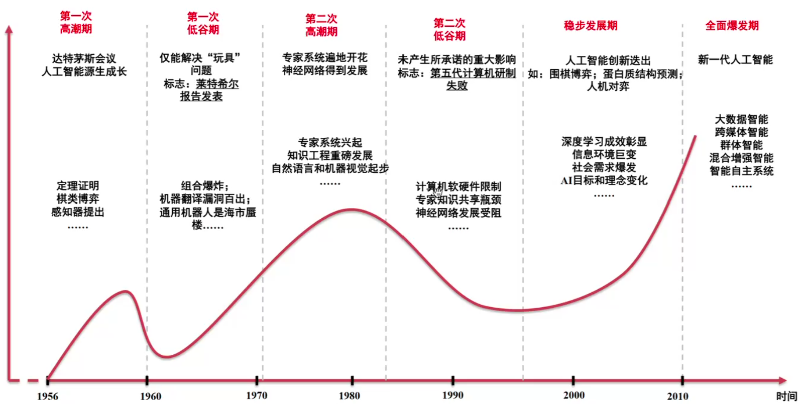

## 基本信息
TA：陈谦(ZJU)

## 助教课

### 人工智能的发展

### 推荐

李牧 深度学习

pytorch

## 正式课程

### 什么是machine learning

1. 传统编程：数据+规则->结果
    
    machine learning：数据+结果->规则

2. machine learning需要什么？

    - 数据点
    - 理想输出结果
    - 衡量算法优劣的标准

3. 基础想法：

    关键：从庞杂的数据中找到有助于解决问题的最重要的参数

    专家系统会尝试由自身给出，而机器学习，会通过算法给出

